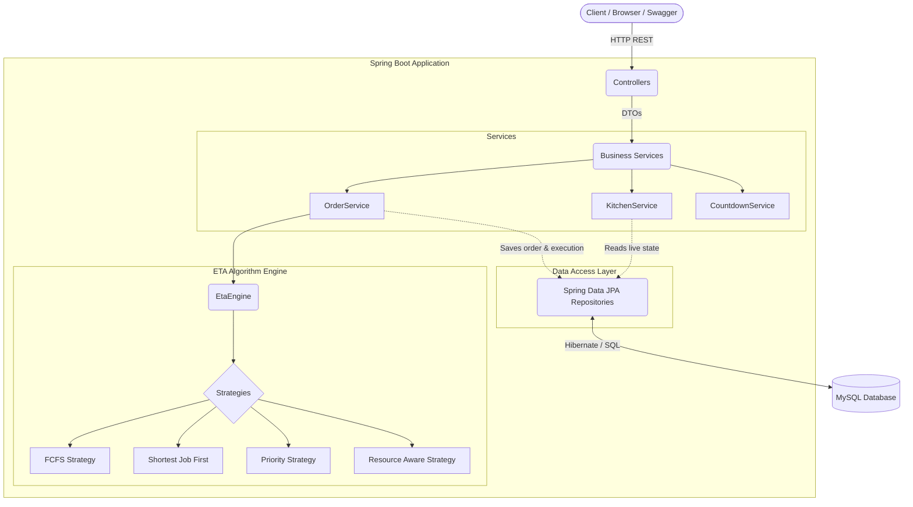

# Architecture Diagram

This document illustrates the high-level system architecture and request flow for the MoonWalk Order ETA System.

```mermaid
flowchart TD
    Client([Client / Browser / Swagger]) -->|HTTP REST| Controller(Controllers)
    
    subgraph Spring Boot Application
        Controller -->|DTOs| Service(Business Services)
        
        subgraph Services
            Service --> OrderService
            Service --> KitchenService
            Service --> CountdownService
        end
        
        subgraph ETA Algorithm Engine
            OrderService --> Engine(EtaEngine)
            Engine --> Strategies{Strategies}
            Strategies --> FCFS[FCFS Strategy]
            Strategies --> SJF[Shortest Job First]
            Strategies --> Priority[Priority Strategy]
            Strategies --> ResourceAware[Resource Aware Strategy]
        end
        
        KitchenService -.->|Reads live state| Repository
        OrderService -.->|Saves order & execution| Repository
        
        subgraph Data Access Layer
            Repository(Spring Data JPA Repositories)
        end
    end
    
    Repository <-->|Hibernate / SQL| DB[(MySQL Database)]
```
