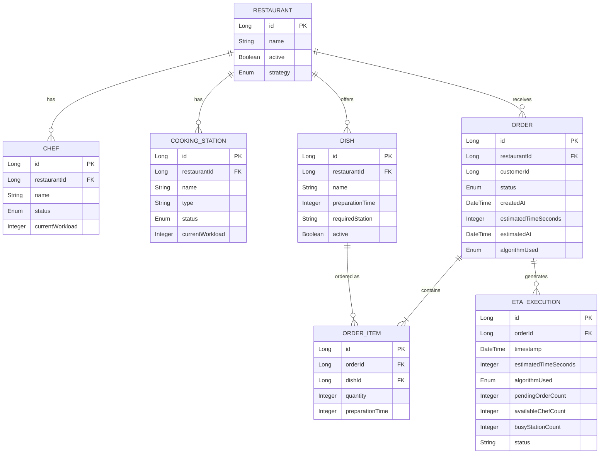

# Entity Relationship (ER) Diagram

This document contains the database schema for the MoonWalk Order ETA System.

```mermaid
erDiagram
    RESTAURANT {
        Long id PK
        String name
        Boolean active
        Enum strategy
    }
    CHEF {
        Long id PK
        Long restaurantId FK
        String name
        Enum status
        Integer currentWorkload
    }
    COOKING_STATION {
        Long id PK
        Long restaurantId FK
        String name
        String type
        Enum status
        Integer currentWorkload
    }
    DISH {
        Long id PK
        Long restaurantId FK
        String name
        Integer preparationTime
        String requiredStation
        Boolean active
    }
    ORDER {
        Long id PK
        Long restaurantId FK
        Long customerId
        Enum status
        DateTime createdAt
        Integer estimatedTimeSeconds
        DateTime estimatedAt
        Enum algorithmUsed
    }
    ORDER_ITEM {
        Long id PK
        Long orderId FK
        Long dishId FK
        Integer quantity
        Integer preparationTime
    }
    ETA_EXECUTION {
        Long id PK
        Long orderId FK
        DateTime timestamp
        Integer estimatedTimeSeconds
        Enum algorithmUsed
        Integer pendingOrderCount
        Integer availableChefCount
        Integer busyStationCount
        String status
    }

    RESTAURANT ||--o{ CHEF : "has"
    RESTAURANT ||--o{ COOKING_STATION : "has"
    RESTAURANT ||--o{ DISH : "offers"
    RESTAURANT ||--o{ ORDER : "receives"
    
    ORDER ||--|{ ORDER_ITEM : "contains"
    DISH ||--o{ ORDER_ITEM : "ordered as"
    
    ORDER ||--o{ ETA_EXECUTION : "generates"
```
